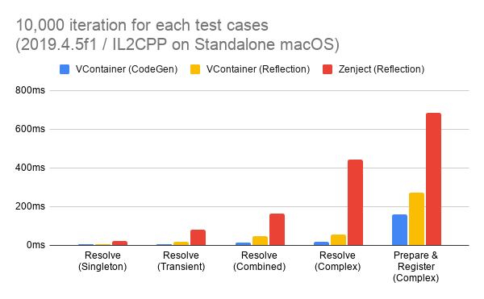

# Container Injector

The extra fast DI (Dependency Injection) library running on Unity Game Engine.

- **Fast Resolve:** Basically 5-10x faster than Zenject.
- **Minimum GC Allocation:** In Resolve, we have **zero allocation** without spawned instances.
- **Small code size:** Few internal types and few .callvirt.
- **Assisting correct DI way:** Provides simple and transparent API, and carefully select features. This prevents the DI declaration from becoming overly complex.
- **Immutable Container:** Thread safety and robustness.

## Features

- Constructor Injection / Method Injection / Property & Field Injection
- Dispatch own PlayerLoopSystem
- Flexible scoping
  - Application can freely create nested Lifetime Scope with any async way for you like.
- Accelerated mode with SourceGenerator (Optional)
- Diagnositcs window on unity editor
- UniTask Integration
- ECS Integration *beta*

## Performance



### GC Alloc Result Example


## Basic Usage

First, create a scope. References are automatically resolved for types registered here.

```csharp
public class GameLifetimeScope : LifetimeScope
{
    public override void Configure(IContainerBuilder builder)
    {
        builder.RegisterEntryPoint<ActorPresenter>();

        builder.Register<CharacterService>(Lifetime.Scoped);
        builder.Register<IRouteSearch, AStarRouteSearch>(Lifetime.Singleton);

        builder.RegisterComponentInHierarchy<ActorsView>();
    }
}
```

Where definitions of classes are

```csharp
public interface IRouteSearch
{
}

public class AStarRouteSearch : IRouteSearch
{
}

public class CharacterService
{
    readonly IRouteSearch routeSearch;

    public CharacterService(IRouteSearch routeSearch)
    {
        this.routeSearch = routeSearch;
    }
}
```

```csharp
public class ActorsView : MonoBehaviour
{
}
```

and

```csharp
public class ActorPresenter : IStartable
{
    readonly CharacterService service;
    readonly ActorsView actorsView;

    public ActorPresenter(
        CharacterService service,
        ActorsView actorsView)
    {
        this.service = service;
        this.actorsView = actorsView;
    }

    void IStartable.Start()
    {
        // Scheduled at Start () on V-Container's own PlayerLoopSystem.
    }
}
```


- In this example, the routeSearch of CharacterService is automatically set as the instance of AStarRouteSearch when CharacterService is resolved.
- Further, V-Container can have a Pure C# class as an entry point. (Various timings such as Start, Update, etc. can be specified.) This facilitates "separation of domain logic and presentation".

### Flexible Scoping with async

LifetimeScope can dynamically create children. This allows you to deal with the asynchronous resource loading that often occurs in games.

```csharp
public void LoadLevel()
{
    // ... Loading some assets

    // Create a child scope
    instantScope = currentScope.CreateChild();

    // Create a child scope with LifetimeScope prefab
    instantScope = currentScope.CreateChildFromPrefab(lifetimeScopePrefab);

    // Create a child with additional registration
    instantScope = currentScope.CreateChildFromPrefab(
        lifetimeScopePrefab,
        builder =>
        {
            // Extra Registrations ...
        });

    instantScope = currentScope.CreateChild(builder =>
    {
        // ExtraRegistrations ...
    });

    instantScope = currentScope.CreateChild(extraInstaller);
}

public void UnloadLevel()
{
    instantScope.Dispose();
}
```

In addition, you can create a parent-child relationship with LifetimeScope in an Additive scene.

```csharp
class SceneLoader
{
    readonly LifetimeScope currentScope;

    public SceneLoader(LifetimeScope currentScope)
    {
        this.currentScope = currentScope; // Inject the LifetimeScope to which this class belongs
    }

    IEnumerator LoadSceneAsync()
    {
        // LifetimeScope generated in this block will be parented by `this.lifetimeScope`
        using (LifetimeScope.EnqueueParent(currentScope))
        {
            // If this scene has a LifetimeScope, its parent will be `parent`.
            var loading = SceneManager.LoadSceneAsync("...", LoadSceneMode.Additive);
            while (!loading.isDone)
            {
                yield return null;
            }
        }
    }

    // UniTask example
    async UniTask LoadSceneAsync()
    {
        using (LifetimeScope.EnqueueParent(parent))
        {
            await SceneManager.LoadSceneAsync("...", LoadSceneMode.Additive);
        }
    }
}
```

```csharp
// LifetimeScopes generated during this block will be additionally Registered.
using (LifetimeScope.Enqueue(builder =>
{
    // Register for the next scene not yet loaded
    builder.RegisterInstance(extraInstance);
}))
{
    // Loading the scene..
}
```